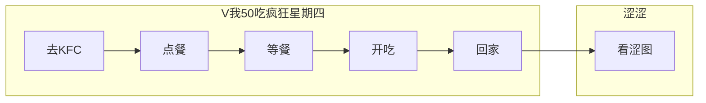
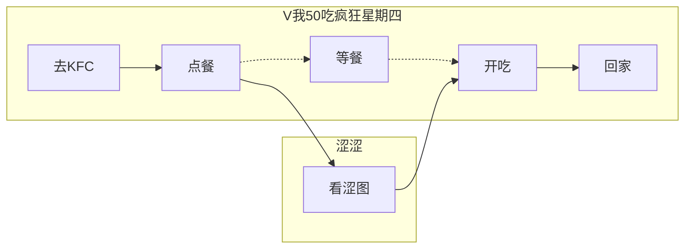

# 来点网上的涩图

:::danger
本章**可能还没完成**，还有部分地方**需要斟酌**
:::

:::warning
由于各种原因，我们在此并不能使用**超赞的涩图库**
<br /><curtain>这种东西可是至宝，怎么会轻易给你 o(´^ ｀)o</curtain>
:::

先来介绍一下安装

:::tip
虽然说 **Graia Ariadne** 的依赖项里面是有 `aiohttp` 的，
但是为了让你能够记得你用了什么库，我们还是建议你写一下
:::

```sh
poetry add aiohttp
# 👇假设你想要极致的速度
poetry add aiohttp[speedups]
```

然后介绍一下 aiohttp 最简单的用吧(<ゝω・)～☆

```python
import asyncio
from pathlib import Path

import aiohttp


async def very_simple_example():
    #注：这里为了教学，故意让 api 返回 json 形式
    ero_url = "https://www.bing.com/HPImageArchive.aspx?format=js&n=1"
    async with aiohttp.ClientSession() as session:
        async with session.get(ero_url) as r:
            ret = await r.json()
        pic_url = "https://cn.bing.com" + ret["images"][0]["url"]
        async with session.get(pic_url) as r:
            pic = await r.read()

    #将二进制数据储存在这里面
    Path("./GraiaX/EroEroBot/eropic.jpg").write_bytes(pic)


asyncio.run(very_simple_example())
```

让我们先整一个与上面相似的使用的 `requests` 办法方便下一小节举例：

```python
from pathlib import Path

import requests


def very_simple_example():
    ero_url = "https://www.bing.com/HPImageArchive.aspx?format=js&n=1"
    ss = requests.session()
    ret = ss.get(ero_url).json()
    pic_url = "https://cn.bing.com" + ret["images"][0]["url"]
    pic = ss.get(pic_url).content
    Path("./GraiaX/EroEroBot/eropic.jpg").write_bytes(pic)

very_simple_example()
```

## 为啥要用 aiohttp

:::tip
这里并发使用的是 aiohttp 只是因为 Ariadne 本身就有 aiohttp，不用装额外的库。
你也可以使用 `httpx` 等支持并发的库，效果也是相同的。
:::

在此之前，我们再加一个问题，
我们在每次构建 Listener 的时候都像下面这样，你可以找找，与一般的 Python 的函数构造方法有什么不同：

```python
async def test(app: Ariadne): ...
```

~~易得~~，相比于一般的函数构造方法，我们会在 `def` 的前面加上 `async`，这是为什么呢？  
~~其实我也在寻找着这个答案。~~

简单说一下，`async / await` 关键字就是为了 `asyncio` 而诞生的，
而 asyncio，就是是用来编写**异步**代码的库。

## 异步是什么？

:::warning
以下介绍是为了让你能够较为方便地大概理解异步的**大致**和**好处**，
并没有深入探讨更底层的内容，也不包括回调函数等一系列东西。

假设你真的很想进一步了解 asyncio，请阅读[Graia Ariadne 官方文档关于 asyncio 的介绍](https://graia.cn/ariadne/appendix/asyncio-intro/)（进行一个鱼的摸）
:::

首先，我们需要知道，我们前面一直提到的异步，其实是指协程（Coroutine），除了协程以外，多线程也是异步的一种，
但我们一般默认都是指协程，让我们先来假设一个场景，比如说...

<p align="center" style="font-size: 30px"><strong><a href="https://zh.moegirl.org.cn/%E7%96%AF%E7%8B%82%E6%98%9F%E6%9C%9F%E5%9B%9B"  target="_blank">狂 乱 木 曜 日</a></strong></p>

假设今天是星期四，然后你带着不知道从哪搞到的 50 块钱，准备去 KFC。
然后这是你的出门行动路径：



这时候不知道你是否发现了一个问题：等餐的时间，你好像什么都没做诶。
明明等餐的时候你可以做点其他事情，但却只能在餐到了才能做下一件事情。

而这，就像是获取网络资源的你，你向网站发送相关请求，然后在网站返回之前，你就只能等着。
明明这个时候你完全可以处理别的事物，却只能等着网络请求。
有时候，这网络请求一等就是十多秒。十多秒的时间啊！

所以，很多人吐槽说机器人有时候会停止响应，也是这个原因：  
你使用的**同步**操作会使整个机器人必须等网站响应才能处理下一个请求。

深知 “时间就是金钱” 这个道理的你，开始尝试优化了一下你的路线，然后做了以下调整：



在这种情况下，你充分利用了等餐的时间，看了点涩图。这样子，整个计划就省下了“回家之后看涩图”的时间。
就如同老师说的**合理运用碎片化时间**一样，你成功合理运用了这段时间，使得整体处理速度更加高效起来。

类比到网络上，就是在你发送请求后，就开始处理别的事情，而不是傻乎乎在那里等待。
等到网站给你回复后，你再去查看回复，并且去做后面的处理。

<div v-if="new Date().getDay() == 4">
  <div class="tip custom-block">
    <p class="custom-block-title">提示</p>
    <p><strong>虽然上文说的是假设今天是星期四，但今天真的是星期四，不吃吗</strong></p>
  </div>
  <hr/>
</div>

为了实现这种“能在干一件事情干到一半的时候能去处理另一件事”的能力，**Graia Ariadne** 也使用 aiohttp 以保证并发的高效性，
而 aiohttp 即是一个异步请求库，能够保证你在请求发送完，等待网站回复的时候干别的事情。

:::warning
注意一下，**并不是说把一个函数前面加上 `async` 就是异步了**

```python
async def test():
    r = requests.get("https://i1.hdslb.com/bfs/archive/5242750857121e05146d5d5b13a47a2a6dd36e98.jpg")
```

你要是写出了这种东西，还是速速 remake （指重看 asyncio 文档）吧
:::

## 使用统一的 Session

你有没有想过，假如每一次网络请求都要通过 `async with aiohttp.ClientSession() as session:`
非常麻烦，我可不可以把 Session 存起来，这样就不用每次都要重新创建一个 Session 对象了？

在上面我们提到 Ariadne 也使用了 aiohttp，而使用 aiohttp 都需要先获取一个 session，那么我们能不能直接白嫖
Ariadne 的 session 呢？

那当然可以，具体要怎么做呢？其实直接进行替换就 OK，直接上代码吧：

```python
session = Ariadne.service.client_session
async with session.get(...) as resp:
    pic = await r.read()
```

在[aiohttp 官方文档的这里](https://docs.aiohttp.org/en/stable/client_quickstart.html#make-a-request)有一个 Note 👇  
**不要为每一个请求都创造一个会话。 (Don't create a session per request.)**

假设你直接调用 Ariadne 本身的会话（session），那你机器人的性能会好一点（当然这好的一点点你可能都感觉不到）。

不过这样做也有一定的有缺点 —— **降低了代码移植效率**。  
假设你需要移植代码或者 Ariadne 进行 Breaking Change 的时候（如切换到 v5 框架，或 Ariadne 0.6.x -> 0.7.x），就需要更改获取 session 的代码。

至于要不要用 Ariadne 自带的 session，就是你的选择了。

:::interlink EroEroBot
本章完整示例可在 [EroEroBot/modules/image_from_internet.py](https://github.com/GraiaCommunity/EroEroBot/blob/master/modules/image_from_internet.py) 找到。
:::
